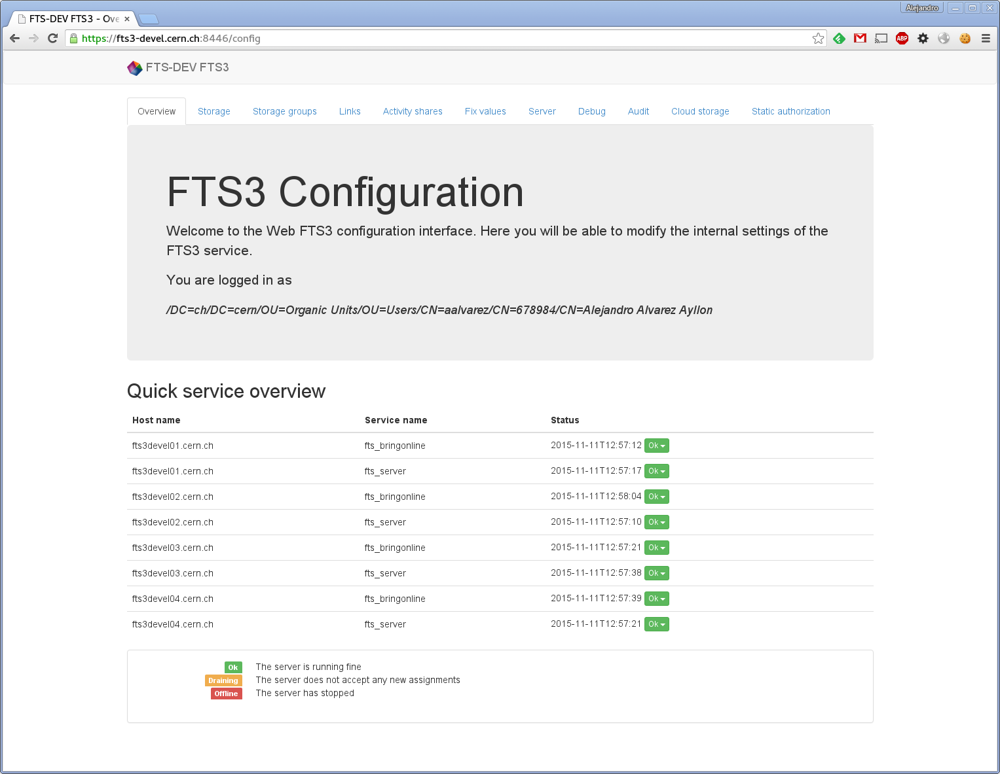

Alternatives to fts-config-\* and fts-set-\*
============================================
The REST API provides actually *two* different manners to configure an FTS3 instance:
via the graphical interface, or using directly the API with, for instance, curl.



## General considerations
FTS3 auto-optimizer has shown that it can get good performance from almost any link, so generally it is discouraged to change any default unless really needed.

For instance, it could be that FTS3 is overly cautious, or overly aggressive with a particular endpoint. In those cases, it makes sense to increase the limits, or even to fix a value, disabling effectively the optimizer. Again, this is discouraged.

## Using curl
Here is a list of alternatives to the fts-config and fts-set parameters and their flags.
We avoid repeating the proxy and CA path each time, so whenever you see `curl`, expand it to
```bash
curl -E "${X509_USER_PROXY}" --cacert "${X509_USER_PROXY}" --capath "/etc/grid-security/certificates"
```

### Make sure you can actually configure
Run
```bash
curl https://fts3-devel.cern.ch:8446/whoami
```
and make sure you have `"config": "all"` in `"level'`. For instance

```json
{
    "dn": [
        "/DC=ch/DC=cern/OU=Organic Units/OU=Users/CN=xyz",
        "/DC=ch/DC=cern/OU=Organic Units/OU=Users/CN=xyz/CN=proxy"
    ],
    "roles": [
        "lcgadmin"
    ],
    "delegation_id": "123456789",
    "user_dn": "/DC=ch/DC=cern/OU=Organic Units/OU=Users/CN=xyz",
    "level": {
        "transfer": "vo",
        "config": "all", // Look for this line
        "datamanagement": "all"
    },
    "is_root": false, // This will be true if you use the host certificate to connect
    "vos": [
        "dteam"
    ],
    "voms_cred": [
        "/dteam/Role=lcgadmin/Capability=NULL",
        "/dteam/Role=NULL/Capability=NULL"
    ],
    "method": "certificate"
}
```

### fts-set-debug
There is no fts-get-debug, but REST supports it
```bash
curl https://fts3-devel.cern.ch:8446/config/debug
[
  {
    "debug_level": 2, 
    "source_se": "gsiftp://sbgse1.in2p3.fr", 
    "dest_se": ""
  }, 
  {
    "debug_level": 2, 
    "source_se": "", 
    "dest_se": "davs+3rd://dpmhead-trunk.cern.ch"
  }
]
```

For changing the debug level of an endpoint
```bash
# fts-set-debug -s https://fts3-devel.cern.ch:8443 --source gsiftp://nowhere 5
curl https://fts3-devel.cern.ch:8446/config/debug -H "Content-Type: application/json" -X POST -d '{"source_se": "gsiftp://nowhere", "debug_level": 5}'
# fts-set-debug -s https://fts3-devel.cern.ch:8443 --destination gsiftp://nowhere 5
curl https://fts3-devel.cern.ch:8446/config/debug -H "Content-Type: application/json" -X POST -d '{"dest_se": "gsiftp://nowhere", "debug_level": 5}'
```

If the level is 0, then the entry will be removed.

### fts-set-blacklist
fts-set-blacklist requires specifying the type to be blacklisted. Via REST, the url is used to tell them apart.

```bash
# fts-set-blacklist -s https://fts3-devel.cern.ch:8443 dn /DC=cern/CN=someone on
curl https://fts3-devel.cern.ch:8446/ban/dn -H "Content-Type: application/json" -X POST -d '{"user_dn": "/DC=cern/CN=someone", "message": "Banning someone because reasons"}'
# fts-set-blacklist -s https://fts3-devel.cern.ch:8443 dn /DC=cern/CN=someone off
curl -X DELETE "https://fts3-devel.cern.ch:8446/ban/dn?user_dn=/DC=cern/CN=someone"
```

Remember, that in addition you can retrieve the list of banned DN
```bash
curl https://fts3-devel.cern.ch:8446/ban/dn
```

```bash
# fts-set-blacklist -s https://fts3-devel.cern.ch:8443 se gsiftp://nowhere on
curl https://fts3-devel.cern.ch:8446/ban/se -H "Content-Type: application/json" -X POST -d '{"storage": "gsiftp://nowhere", "message": "Banning a storage because reasons"}'
# fts-set-blacklist -s https://fts3-devel.cern.ch:8443 se gsiftp://nowhere off
curl -X DELETE "https://fts3-devel.cern.ch:8446/ban/se?storage=gsiftp://nowhere"
```

You also can list the list of banned storages

```bash
curl https://fts3-devel.cern.ch:8446/ban/se
```

Optional parameters to ban a storage:

```json
'status': 'wait', // cancel or wait
'timeout': 1234
```

If the status is `cancel`, currently queued transfers that contain the storage will be canceled.

If the status is  `wait`, currently queued transfers will be given some time to finish, and canceled after `timeout` seconds if they didn't go through.

### fts-set-priority
This is not, per se, a configuration command, since it modifies the priority of a given job. Still, you can do this via

```bash
# fts-set-priority -s https://fts3-devel.cern.ch:8443 1234-5678-abcde-fghi 5
curl https://fts3-devel.cern.ch:8446/jobs/1234-5678-abcde-fghi -H "Content-Type: application/json" -X POST -d '{"params": {"priority": 4}}'
```

### fts-config-set

#### Drain
```bash
# fts-config-set --drain on
curl https://fts3devel01.cern.ch:8446/config/drain -H "Content-Type: application/json" -X POST -d '{"hostname": "fts3devel01.cern.ch", "drain": true}'
# fts-config-set --drain off
curl https://fts3devel01.cern.ch:8446/config/drain -H "Content-Type: application/json" -X POST -d '{"hostname": "fts3devel01.cern.ch", "drain": false}'
```

### Global configuration
This is a replacement for the flags `--retry`, `--optimizer-mode`, `--queue-timeout`, `--global-timeout`, `--max-per-link`, `--max-per-se`, `--sec-per-mb` and `--show-user-dn`

```bash
curl https://fts3devel01.cern.ch:8446/config/global -H "Content-Type: application/json" -X POST -d "config"
```

Where config is a json with the following parameters

```json
{
    "optimizer_mode": 5, // integer in [1, 3]
    "retry":          0, // default retry number, recommended to 0
    "max_time_queue": 24, // max time for a job to remain in the queue, in hours
    "global_timeout": 3600, // default transfer timeout, in seconds
    "sec_per_mb":     10, // correct timeouts based on the file size (this value * MB)
    "vo_name":     "dteam", // VO for this configuration
    "show_user_dn": false, // Boolean. If false, the user dn is hidden in the monitoring and logs (recommended)
    "max_per_se":  100, // Default max number of transfers per storage element
    "max_per_link": 100 // Default max number of transfers per link
}
```

### Configure a storage
This is a replacement for the flags `--bring-online`, `--delete`, `--protocol`, `--max-bandwidth`, `--max-se-source-active` and `--max-se-dest-active`

```bash
curl https://fts3devel01.cern.ch:8446/config/se -H "Content-Type: application/json" -X POST -d "config"
```

Where config is a json with the following parameters

```json
{
    "test.cern.ch": {
        "operations": {
            "atlas": {
                "delete": 22,
                "staging": 32,
            },
            "dteam": {
                "delete": 10,
                "staging": 11
            }
        },
        "as_source": {
            "ipv6": True,
            "active": 55
        },
        "as_destination": {
            "ipv6": False,
            "active": 1,
            "throughput": 33
        }
    }
}
```

Note that you don't need to configure everything necessarily. `operations`, `as_source` and `as_destination` can be combined as desired (only one, two, or all of them).

### Configure a link
There are no flags for this in the CLI.

```bash
curl https://fts3devel01.cern.ch:8446/config/links -H "Content-Type: application/json" -X POST -d "config"
```

Where config is a json with the following parameters

```json
{
    "symbolicname": "An-unique-name",
    "source": "gsiftp://test.cern.ch",
    "destination": "gsiftp://test2.cern.ch",
    "state": true, // If false, the link configuration is not active
    "nostreams": 16,
    "tcp_buffer_size": 4096,
    "urlcopy_tx_to": 3600, // Transfer timeout, overrides server global, overriden by individual transfers
    "auto_tuning": false // Use FTS auto-tuning. Recommended to leave it as true.
}
```

### Activity shares
There are no flags for this in the CLI.

```bash
curl https://fts3devel01.cern.ch:8446/config/activity_shares -H "Content-Type: application/json" -X POST -d "config"
```

Where config is a json with the following parameters

```json
{
    "vo": "dteam",
    "active": true,
    "share": [
        {"High": 80}, {"Medium": 15}, {"Low": 5}
    ]
}
```
### S3 configuration

S3 storage registration:

```bash
curl https://fts3devel01.cern.ch:8446/config/cloud_storage -H "Content-Type: application/json" -X POST -d '{"storage_name":"S3:CS3.CERN.CH"}'
```
Provide S3 credentials:

```bash
curl https://fts3devel01.cern.ch:8446/config/cloud_storage/S3:CS3.CERN.CH -H "Content-Type: application/json" -X POST -d "config"
```
Where config is a json with the following parameters
```json
{
    "vo_name": "dteam",
    "access_key": "ACCESS_KEY",
    "secret_key": "SECRET_KEY"
}
```


